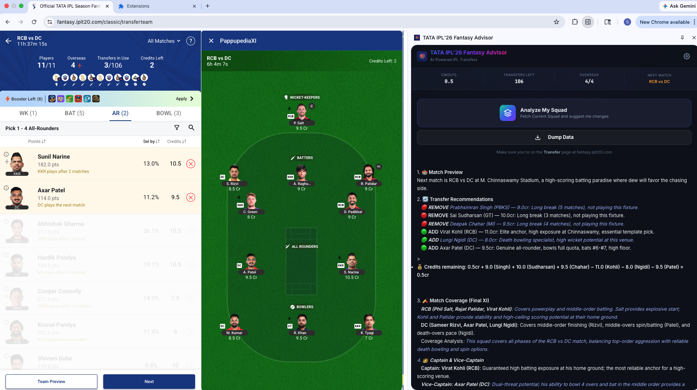
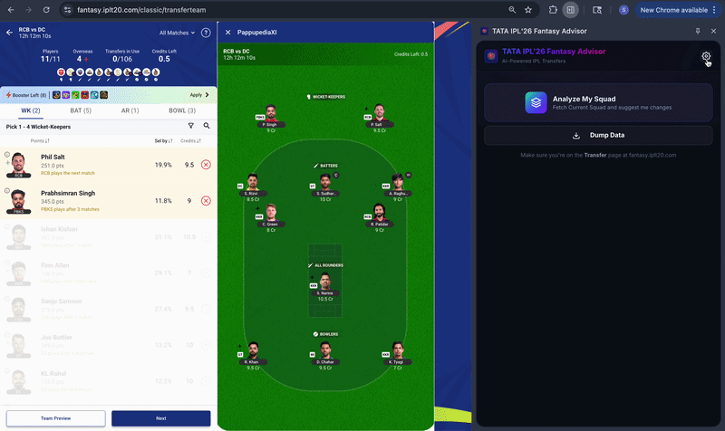

# TATA IPL '26 Fantasy Advisor

> A Chrome extension that delivers AI-powered transfer recommendations for the [TATA IPL Season Long Fantasy 2026](https://fantasy.iplt20.com) game.

[](https://developer.chrome.com/docs/extensions/mv3/intro/)
[](https://ai.google.dev/)
[](#license)

<br>



---

## Overview

Managing a fantasy cricket squad across a 74-match season is hard. This extension sits inside your browser as a side panel, scrapes your current squad directly from the IPL Fantasy Transfer page, and asks Google Gemini to reason through your best transfers — factoring in upcoming fixtures, player form, credit budget, and fantasy scoring rules.

The result: a concise, actionable recommendation you can act on before each match deadline.

---

## Features

- **Automated squad scraping** — reads your current squad and available replacements directly from the Transfer page; no manual data entry
- **AI-powered transfer advice** — Gemini analyses fixture density, batting exposure, bowling phase coverage, and credit economics to recommend optimal transfers
- **Captain & vice-captain guidance** — weekly captaincy picks with reasoning
- **Interactive follow-up chat** — ask hypothetical questions ("what if I bring in X?") using the same conversation context
- **Squad health summary** — at-a-glance stats (credits remaining, transfers used, overseas count)
- **Resilient API calls** — automatic retry with exponential backoff; multi-model fallback if the primary model is unavailable
- **Optional local data logger** — captures every squad snapshot as a timestamped JSON file for tracking and debugging

---

## Tech Stack

| Layer | Technology |
|---|---|
| Extension platform | Chrome Manifest V3 (Service Worker, Content Scripts, Side Panel) |
| UI | Vanilla HTML / CSS / JavaScript |
| AI | Google Gemini 2.5 Flash (with fallback chain) |
| Data | Static `players.json` + hardcoded 2026 schedule |
| Optional tooling | Python 3 (local debug logger) |

---

## Installation

### 1. Clone the repository

```bash
git clone https://github.com/gesourav/ipl-fantasy-recomm.git
cd ipl-fantasy
```

### 2. Load the unpacked extension in Chrome

1. Open `chrome://extensions` in your browser.
2. Enable **Developer mode** (toggle in the top-right corner).
3. Click **Load unpacked** and select the project directory.

The extension icon will appear in your Chrome toolbar.

### 3. Add your Gemini API key

1. Click the extension icon — the side panel opens.
2. Paste your API key into the **Setup Gemini API Key** field.
3. Click **Save & Start**.

The key is stored in `chrome.storage.local` and persists across browser sessions.

---

## Usage

1. Navigate to `fantasy.iplt20.com` and open the **Transfer** page.
2. Click the extension icon to open the side panel.
3. Click **Analyze My Squad**.
   - The extension scrapes your squad from the active tab.
   - The data is sent to Gemini along with player intelligence and fixture context.
   - Recommendations appear in the results panel within seconds.
4. Use the **chat input** at the bottom to ask follow-up questions.

---

## Architecture

```
Browser Tab (fantasy.iplt20.com)
        │  content.js scrapes Transfer page UI
        ▼
 background.js (Service Worker)
        │  builds prompt with squad + players.json + schedule.js context
        │  calls Gemini API (2.5 Flash → fallback chain)
        ▼
   Gemini API
        │  returns markdown recommendation
        ▼
  sidepanel.js
        │  renders result + enables follow-up chat
        ▼
      User
```

**Retry strategy:** failed Gemini calls are retried up to 3 times with exponential backoff (2 s → 4 s → 8 s). If the primary model (`gemini-2.5-flash`) remains unavailable, the extension automatically falls back through `gemini-2.0-flash` and two preview models.

---

## Configuration

| Setting | Where | Notes |
|---|---|---|
| Gemini API key | Chrome local storage (via side panel) | Requires a key starting with `AIza` |
| Primary AI model | `background.js` | Change the `MODEL_CHAIN` array to prefer a different model |
| Player data | `players.json` | Update `playing_status` and notes as the season progresses |
| Fixture schedule | `schedule.js` | Hardcoded for IPL 2026 (March 28 – May 24) |

---

## Updating Player Data

Player availability changes frequently during the season. To keep recommendations accurate:

1. Edit `players.json` and set `"playing_status": "not considered"` for injured or dropped players.
2. Update the `"notes"` field with current form context.
3. Reload the extension at `chrome://extensions` (click the refresh icon on the extension card).

No rebuild is needed — the extension reads `players.json` at runtime via `import`.

---

## Demo



---

## Known Limitations

- Works only on the **Transfer** page of `fantasy.iplt20.com`; the scraper depends on that page's DOM structure.
- Player intelligence (`players.json`) must be maintained manually — there is no automated sync with live data sources.
- Gemini API usage is subject to [Google AI Studio free-tier rate limits].
- The extension is not published to the Chrome Web Store and must be loaded as an unpacked extension.

---

## License

This project is licensed under the [MIT License](LICENSE). It is an independent, unofficial tool built for an Assignment of EAG V3 course by TSAI, and is not affiliated with or endorsed by the BCCI, IPL, or the official TATA IPL Fantasy platform.
